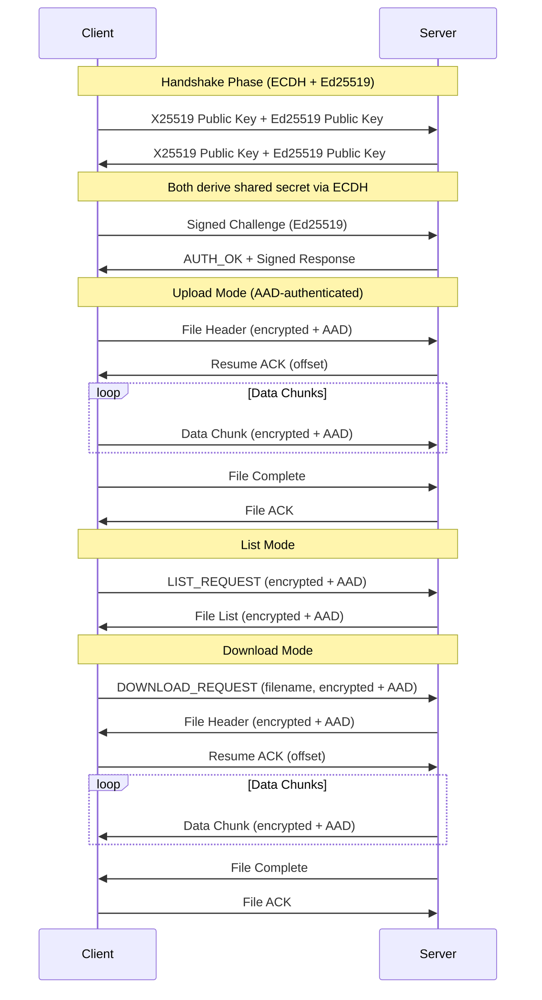

# Secure File Transfer System

[](https://www.python.org/)
[](https://github.com/Yul-1/SFT)
[](https://github.com/Yul-1/SFT)
[](https://github.com/Yul-1/SFT)
[](https://github.com/Yul-1/SFT)
[](https://github.com/Yul-1/SFT)

## Table of Contents

- [Overview](#overview)
- [Key Features](#key-features)
- [System Architecture](#system-architecture)
- [Security](#security)
- [Installation](#installation)
- [Usage](#usage)
- [Testing](#testing)
- [Performance](#performance)
- [Development](#development)
- [Roadmap](#roadmap)
- [Contributing](#contributing)
- [License](#license)

## Overview

Secure File Transfer is a **bidirectional** secure file transfer system designed from the ground up with a "security-first" architecture. The project combines the speed of hardware-accelerated cryptography in C with the security and flexibility of Python, creating a robust solution for secure file transfer over untrusted networks.

**Current version: 1.8.0** - Complete support for upload, download, remote file listing, and proxy connectivity with enhanced cryptographic security.

### Why Secure File Transfer?

While established protocols like SCP and SFTP exist, Secure File Transfer serves as an in-depth study on implementing secure multi-layered software. The system implements advanced countermeasures against common vulnerabilities, offering a modern alternative with particular focus on memory security and resistance to sophisticated attacks.

### Key Features v1.8.0
- **Secure upload** of files to the server
- **Secure download** of files from the server
- **Remote listing** to view available files
- **Proxy Support** for SOCKS4, SOCKS5 and HTTP proxies
- **Automatic resume** of interrupted transfers
- **End-to-end encryption** with AES-256-GCM and ECDH (X25519)
- **Digital signatures** with Ed25519 for authentication
- **Authenticated packet headers** to prevent tampering
- **Replay bypass protection** with sequence number tracking
- **Zombie file protection** with automatic corruption cleanup

## Key Features

### Advanced Encryption
- **AES-256-GCM** for symmetric encryption with integrated authentication
- **ECDH (X25519)** for Diffie-Hellman key exchange (replaces RSA-4096)
- **Ed25519** for digital signatures and authentication
- **HMAC-SHA256** for message integrity signing and verification
- **PBKDF2** with 100,000 iterations for key derivation
- **Authenticated headers** with AAD (Additional Authenticated Data) to prevent packet tampering

### Security Protections
- **Anti-DoS**: Intelligent rate limiting and connection management (mitigates RSA key exhaustion attacks)
- **Anti-Replay**: Detection system based on timestamps and message IDs
- **Anti-Timing**: Constant-time comparisons to prevent side-channel attacks
- **Anti-Tampering**: AAD authentication of packet headers prevents modification
- **Path Traversal Protection**: Strict filename sanitization and validation
- **Memory Safety**: Secure cleanup of keys from memory after use
- **Information Leak Prevention**: Sanitized error messages and side-channel protections

### Performance
- **Hardware Acceleration**: C module compiled with native optimizations
- **Automatic Fallback**: Pure Python system if C module is unavailable
- **Efficient Chunking**: Optimized transfer for large files
- **Resume Support**: Automatic resumption of interrupted transfers

### Reliability
- **Thread-Safe**: Multi-threaded architecture with complete session isolation
- **Bidirectional**: Upload, download, and remote file listing
- **Protocol Validation**: Strict JSON schema for all messages
- **Robust Error Handling**: Graceful recovery from network and protocol errors
- **Comprehensive Logging**: Detailed logging system with automatic rotation

## System Architecture

The system is built on three interconnected layers that work in synergy to provide optimal security and performance:

```
┌─────────────────────────────────────────────────────────────┐
│                    Protocol Layer                           │
│                       (sft.py)                              │
│  • TCP connection management                                │
│  • ECDH (X25519) + Ed25519 handshake                        │
│  • Transfer state machine                                   │
│  • Rate limiting and DoS protections                        │
│  • AAD-authenticated packet headers                         │
└─────────────────────────────────────────────────────────────┘
                              │
                              ▼
┌─────────────────────────────────────────────────────────────┐
│                     Wrapper Layer                           │
│                 (python_wrapper.py)                         │
│  • Unified cryptographic API                                │
│  • C/Python fallback management                             │
│  • Secure key cache                                         │
│  • Statistics and monitoring                                │
└─────────────────────────────────────────────────────────────┘
                              │
                              ▼
┌─────────────────────────────────────────────────────────────┐
│                      Core Layer                             │
│               (crypto_accelerator.c)                        │
│  • AES-256-GCM encryption via OpenSSL                       │
│  • Secure random number generation                          │
│  • SHA-256 hashing                                          │
│  • Constant-time comparisons                                │
└─────────────────────────────────────────────────────────────┘
```

### Protocol Flow



## Security

### Security Enhancements in v1.7.0 - v1.8.0

- **ECDH Migration**: Replaced RSA-4096 with X25519 Elliptic Curve Diffie-Hellman to eliminate RSA key exhaustion DoS attacks while maintaining strong security
- **Ed25519 Signatures**: Added digital signature authentication for non-repudiation and enhanced identity verification
- **AAD Authentication**: All packet headers are now authenticated using Additional Authenticated Data (AAD) in AES-GCM, preventing header tampering attacks
- **Information Leak Prevention**: Sanitized error messages and strict validation to prevent side-channel vulnerabilities
- **Path Traversal Hardening**: Enhanced filename validation on both client and server to prevent directory traversal attacks
- **Replay Bypass Mitigation**: Sequence number tracking with sliding window algorithm prevents FIFO queue flooding attacks
- **Zombie File Protection**: Automatic removal of corrupted files when hash verification fails

### Multi-Layer Protection

The system implements defense in depth with multiple protections at every layer:

#### Network Layer
- **Adaptive Rate Limiting**: Prevents connection and request flooding
- **Connection Pooling**: Maximum limit of 50 simultaneous connections
- **Socket Timeout**: 30 seconds to prevent slowloris attacks
- **IP-based Filtering**: Per-client request tracking

#### Protocol Layer
- **Message Authentication**: Every packet is signed with HMAC-SHA256
- **Replay Detection**: FIFO queue of 1000 message IDs to detect duplicates
- **Timestamp Validation**: 5-minute tolerance to prevent delayed replays
- **Schema Validation**: Strict JSON Schema for all messages

#### Cryptographic Layer
- **ECDH Key Exchange**: X25519 Elliptic Curve Diffie-Hellman for key agreement
- **Digital Signatures**: Ed25519 for authentication and non-repudiation
- **Perfect Forward Secrecy**: New ephemeral keys for each session
- **Authenticated Encryption**: AES-GCM with AAD for confidentiality, integrity, and header authentication
- **Secure Random**: Generation via OpenSSL RAND_bytes or secrets.token_bytes
- **DoS Resistance**: ECDH prevents RSA key exhaustion attacks

#### Memory Layer
- **Secure Zeroing**: Explicit cleanup of keys from memory
- **Buffer Limits**: Maximum 10MB per packet to prevent overflow
- **Stack Protection**: Compilation with -fstack-protector-strong
- **FORTIFY_SOURCE**: Runtime protection against buffer overflow

### Specific Mitigations

| Vulnerability | Implemented Mitigation |
|--------------|------------------------|
| DoS/DDoS | Rate limiting, connection limits, timeout, ECDH (no RSA exhaustion) |
| Replay Attack | Message ID tracking, timestamp validation, sequence number with sliding window |
| Replay Bypass | Sliding window algorithm (10000 entries) prevents FIFO queue flooding |
| Timing Attack | Constant-time comparison (CRYPTO_memcmp) |
| Path Traversal | Filename sanitization, basename extraction, validation |
| Memory Leaks | Explicit memory zeroing, automatic cleanup |
| Buffer Overflow | Size validation, FORTIFY_SOURCE |
| MITM | ECDH (X25519) + Ed25519 authentication |
| Packet Tampering | AAD authentication on all packet headers |
| Information Leak | Sanitized errors, side-channel protections |
| Key Exhaustion | ECDH with ephemeral keys (replaces RSA) |
| Zombie Files | Automatic removal of corrupted files on hash mismatch |

## Installation

### System Requirements

SFT requires system-level dependencies for compilation and cryptographic operations. See `system_requirements.txt` for complete details.

**Minimum versions:**
- Python 3.9+
- GCC 4.8+ (for C11 support)
- OpenSSL 1.1.1+

### Prerequisites

#### Ubuntu/Debian
```bash
sudo apt update
sudo apt install -y build-essential python3-dev libssl-dev python3-pip git python3-venv
```

#### RHEL/CentOS/Fedora
```bash
sudo yum groupinstall "Development Tools"
sudo yum install -y python3-devel openssl-devel python3-pip git
```

#### macOS
```bash
brew install python openssl
export LDFLAGS="-L$(brew --prefix openssl)/lib"
export CPPFLAGS="-I$(brew --prefix openssl)/include"
```

#### Alpine Linux
```bash
apk add --no-cache gcc musl-dev python3-dev libffi-dev openssl-dev make git
```

#### Windows
```powershell
# Requires Visual Studio Build Tools
# Download from: https://visualstudio.microsoft.com/downloads/#build-tools-for-visual-studio-2022
```

### Verification

Verify that all system dependencies are installed:

```bash
# Check versions
python3 --version          # Should be >= 3.9
gcc --version              # Should be >= 4.8
openssl version            # Should be >= 1.1.1
pip3 --version

# Verify development headers
python3-config --includes  # Should return include paths
pkg-config --cflags openssl # Should return OpenSSL paths
```

### Standard Installation

```bash
# 1. Clone the repository
git clone https://github.com/Yul-1/Secure-File-Transfer
cd SFT

# 2. Create virtual environment (recommended)
python3 -m venv venv
source venv/bin/activate  # Linux/macOS
# or
venv\Scripts\activate  # Windows

# 3. Install Python dependencies
pip install -r requirements.txt

# 4. Compile C module (optional but recommended for performance)
python3 python_wrapper.py --compile

# 5. Verify installation
python3 python_wrapper.py --test
```

**Note:** The C module is optional. If compilation fails, SFT will automatically fall back to pure Python cryptography with reduced performance.

### Troubleshooting

#### ModuleNotFoundError: No module named 'socks'

**Cause:** Dependencies not installed or running outside virtual environment.

**Solution:**
```bash
# Ensure you are in the virtual environment
source venv/bin/activate  # Linux/macOS
# or
venv\Scripts\activate  # Windows

# Verify activation (should show venv path)
which python3

# Install dependencies
pip install -r requirements.txt

# Verify PySocks installation
python3 -c "import socks; print(socks.__version__)"
```

#### C Module Compilation Fails

**Cause:** Missing system dependencies (GCC, OpenSSL headers, Python dev headers).

**Solution:** Install system prerequisites from the "Prerequisites" section above, then retry:
```bash
python3 python_wrapper.py --compile
```

**Fallback:** The system automatically uses pure Python cryptography if C module is unavailable.

## Usage

### Starting the Server

#### Basic Configuration
```bash
# Start server on default port (5555)
python3 sft.py --mode server

# Start on specific port
python3 sft.py --mode server --port 8080

# Start on specific interface
python3 sft.py --mode server --host 192.168.1.100 --port 5555
```

#### Production Configuration
```bash
# Production server with logging
nohup python3 sft.py --mode server \
    --host 0.0.0.0 \
    --port 5555 > server.log 2>&1 &
```

### Client Operations

#### Proxy Support

The client supports connecting to the server through SOCKS4, SOCKS5, or HTTP proxies for enhanced privacy and network traversal capabilities.

**SECURITY WARNING**: Proxy credentials are passed as command-line arguments, which may be visible in process listings and shell history on shared systems. Recommendations:
- Use unauthenticated local proxies when possible
- Employ environment isolation (containers, VMs) when using credentials
- Clear shell history after use on multi-user systems
- Avoid hardcoding credentials in scripts

**Proxy Configuration Arguments**:
- `--proxy-type`: Proxy protocol (choices: socks4, socks5, http)
- `--proxy-host`: Proxy server hostname or IP address
- `--proxy-port`: Proxy server port (1-65535)
- `--proxy-user`: (Optional) Proxy authentication username (max 255 chars)
- `--proxy-pass`: (Optional) Proxy authentication password (max 255 chars)

**Input Validation**: All proxy parameters are strictly validated to prevent injection attacks. Null bytes and excessive lengths are rejected.

**Example - Unauthenticated SOCKS5 proxy**:
```bash
python3 sft.py --mode client \
    --connect server.example.com:5555 \
    --file large_file.zip \
    --proxy-type socks5 \
    --proxy-host 127.0.0.1 \
    --proxy-port 1080
```

**Example - Authenticated proxy**:
```bash
python3 sft.py --mode client \
    --connect server.example.com:5555 \
    --file large_file.zip \
    --proxy-type socks5 \
    --proxy-host 127.0.0.1 \
    --proxy-port 1080 \
    --proxy-user myuser \
    --proxy-pass mypassword
```

**Example - HTTP proxy for corporate networks**:
```bash
python3 sft.py --mode client \
    --connect server.example.com:5555 \
    --download important.pdf \
    --proxy-type http \
    --proxy-host proxy.corporate.local \
    --proxy-port 8080
```

**Proxy Requirements**:
- SOCKS4: Basic TCP tunneling (no DNS resolution, no auth in most implementations)
- SOCKS5: Full TCP/UDP support, DNS resolution, optional authentication
- HTTP: CONNECT method support required for HTTPS-like tunneling

**Note**: When using a proxy, the client validates hostname format but delegates DNS resolution to the proxy server. Ensure the proxy is trusted to prevent DNS-based attacks.

#### Upload File
```bash
# Upload file to server
python3 sft.py --mode client \
    --connect 192.168.1.100:5555 \
    --file /path/to/document.pdf

# Upload with progress
python3 sft.py --mode client \
    --connect server.example.com:5555 \
    --file large_file.zip
```

#### List Remote Files
```bash
# List available files on server
python3 sft.py --mode client \
    --connect 192.168.1.100:5555 \
    --list
```

#### Download File
```bash
# Download specific file
python3 sft.py --mode client \
    --connect 192.168.1.100:5555 \
    --download document.pdf

# Download to specific directory
python3 sft.py --mode client \
    --connect 192.168.1.100:5555 \
    --download backup.tar.gz \
    --output /home/user/downloads/

# Resume interrupted download
python3 sft.py --mode client \
    --connect 192.168.1.100:5555 \
    --download large_file.iso \
    --output ./downloads/
```

### Advanced Examples

#### Bidirectional Secure Backup
```bash
# Backup server
python3 sft.py --mode server --port 8888

# Client - send backup
python3 sft.py --mode client \
    --connect backup-server:8888 \
    --file /path/to/backup.tar.gz

# Client - retrieve previous backups
# 1. List available backups
python3 sft.py --mode client \
    --connect backup-server:8888 \
    --list

# 2. Download specific backup
python3 sft.py --mode client \
    --connect backup-server:8888 \
    --download backup_2024-11-22.tar.gz \
    --output /restore/
```

#### Transfer with Monitoring
```python
# monitor_transfer.py
import subprocess
import time

def transfer_with_monitoring(server, file_path):
    """Transfer file with status monitoring"""
    cmd = [
        "python3", "sft.py",
        "--mode", "client",
        "--connect", server,
        "--file", file_path
    ]

    process = subprocess.Popen(cmd, stdout=subprocess.PIPE, stderr=subprocess.PIPE)

    while process.poll() is None:
        time.sleep(1)
        print(".", end="", flush=True)

    if process.returncode == 0:
        print("\nTransfer completed successfully!")
    else:
        print(f"\nTransfer error: {process.stderr.read()}")

# Usage
transfer_with_monitoring("192.168.1.50:5555", "important_data.db")
```

## Testing

### Comprehensive Test Suite

The project includes a comprehensive test suite with over 50 test cases:

```bash
# Run all tests
python3 -m pytest tests/ -v

# Category-specific tests
python3 -m pytest tests/test_crypto_accelerator.py -v  # C module tests
python3 -m pytest tests/test_python_wrapper.py -v      # Wrapper tests
python3 -m pytest tests/test_security_protocol.py -v   # Protocol tests
python3 -m pytest tests/test_dos_mitigation.py -v      # Anti-DoS tests
python3 -m pytest tests/test_concurrency.py -v         # Concurrency tests
```

### Performance Testing

```bash
# Cryptographic benchmark
python3 python_wrapper.py --benchmark

# Large file transfer test
dd if=/dev/urandom of=test_1gb.bin bs=1M count=1024
time python3 sft.py --mode client \
    --connect localhost:5555 --file test_1gb.bin
```

## Performance

### Comparative Benchmarks

| Operation | C Module | Pure Python | Speedup |
|-----------|----------|-------------|---------|
| AES-256-GCM (10MB) | 0.042s | 0.385s | 9.2x |
| SHA-256 (100MB) | 0.156s | 1.823s | 11.7x |
| Random Gen (1MB) | 0.008s | 0.031s | 3.9x |
| File Transfer (100MB) | 2.3s | 8.7s | 3.8x |

### Implemented Optimizations

- **Zero-copy I/O**: Use of sendfile() where available
- **Buffer pooling**: Buffer reuse to reduce allocations
- **Parallel processing**: Separate threads for I/O and cryptography
- **Native optimizations**: Compilation with -O3 -march=native

## Development

### Project Structure

```
SFT/
├── sft.py                          # Main protocol (v1.8.0)
├── python_wrapper.py               # Cryptographic wrapper
├── crypto_accelerator.c            # C module (source)
├── requirements.txt                # Python dependencies (pip)
├── system_requirements.txt         # System dependencies (apt/yum/brew)
├── proxy_testing.md                # Proxy testing guide
├── tests/                          # Test suite
│   ├── conftest.py                 # Pytest fixtures
│   ├── test_crypto_accelerator.py
│   ├── test_python_wrapper.py
│   ├── test_security_protocol.py
│   ├── test_dos_mitigation.py
│   ├── test_concurrency.py
│   ├── test_unit_sft.py
│   ├── test_proxy.py               # Proxy functionality tests
│   ├── test_new_crypto_ecdh.py     # ECDH/Ed25519 tests
│   ├── test_advanced_security.py   # Advanced security tests
│   ├── test_p0_security.py         # Priority 0 security tests
│   ├── test_p1_robustness.py       # Priority 1 robustness tests
│   ├── test_p2_completeness.py     # Priority 2 completeness tests
│   └── test_p2_unit_completeness.py
├── ricevuti/                       # Output directory (created at runtime)
└── README.md                       # This file
```

### Development Environment

```bash
# Setup development environment
git clone https://github.com/Yul-1/Secure-File-Transfer
cd SFT
python3 -m venv venv
source venv/bin/activate
pip install -r requirements.txt

# Debug compilation of C module
gcc -shared -fPIC -g -O0 -DDEBUG \
    crypto_accelerator.c -o crypto_accelerator.so -lcrypto

# Run with debug logging
DEBUG=1 python3 sft.py --mode server --debug
```

### Contributing Guidelines

1. **Fork** the repository
2. **Create** a feature branch (`git checkout -b feature/AmazingFeature`)
3. **Commit** your changes (`git commit -m 'Add AmazingFeature'`)
4. **Push** to the branch (`git push origin feature/AmazingFeature`)
5. **Open** a Pull Request

#### Code Standards

- **Python**: PEP 8 with line length 100
- **C**: Linux kernel style
- **Tests**: Minimum 80% coverage for new features
- **Documentation**: Docstrings for all public functions

## Version History

### Version 1.0.0
- [x] Initial release
- [x] Secure file transfer protocol implementation
- [x] AES-256-GCM encryption with RSA-4096
- [x] Basic TCP connection management
- [x] Core cryptographic operations

### Version 1.1.0
- [x] Ping/pong handshake system implementation
- [x] Client/server connection crash fixes
- [x] Double handshake prevention
- [x] Protocol corrections (Key ID handling, message alignment)
- [x] Security test additions (nonce uniqueness, anti-replay)

### Version 1.1.1
- [x] Chunking, resume, and callbacks for file transfers
- [x] Improved disconnection handling
- [x] Removed rate limiting for file transfers
- [x] Complete test suite achievement (27/27 tests passed)

### Version 1.2.0
- [x] Race condition fix in _handle_connection
- [x] Repository cleanup (removed compiled binaries)
- [x] Pre-handshake rate-limiting with ConnectionLimiter
- [x] DoS mitigation (CPU exhaustion from network scans)
- [x] DoS mitigation test suite and traffic analysis

### Version 1.3.0
- [x] Concurrency race condition fixes (per-thread state)
- [x] Added comprehensive documentation (README and requirements.txt)
- [x] Critical security, integrity, and bug patches
- [x] Logic and robustness improvements
- [x] C-code corrections and integration test alignment

### Version 1.3.1
- [x] Resolved critical QA issues (#13, #17, #18, #20)

### Version 1.4.0
- [x] Penetration test fixes (Idle DoS, client memory persistence, PRNG seeding)
- [x] Added installer.sh for Linux systems

### Version 1.4.1
- [x] Bidirectionality implementation (list and download)
- [x] Information leak vulnerability fixes
- [x] Path traversal protection enhancements

### Version 1.5.0
- [x] Resolved 12 critical bugs (memory corruption C, key cleanup, download overwrite with secure temp files, RateLimiter leak, missing validations)
- [x] Comprehensive test suite updates
- [x] QA fixes (clear_key_cache, bytes type assertions)

### Version 1.6.0
- [x] Complete documentation translation to English
- [x] Component refactoring and renaming
- [x] AAD (Additional Authenticated Data) implementation on packet headers
- [x] Packet header authentication to prevent tampering attacks
- [x] Minor fixes and improvements

### Version 1.7.0
- [x] Migration from RSA to ECDH (X25519) for key exchange
- [x] Ed25519 digital signatures for authentication
- [x] RSA key exhaustion DoS mitigation
- [x] Zombie file protection (automatic removal of corrupted files after hash verification failure)
- [x] Replay bypass mitigation (sequence number tracking with sliding window algorithm)
- [x] Updated test suite for new cryptography primitives

### Version 1.8.0 (Current)
- [x] Proxy support implementation (SOCKS4/SOCKS5/HTTP)
- [x] Proxy testing guide and system requirements documentation
- [x] Enhanced SOCKS5 connection error diagnostics
- [x] Dependency troubleshooting documentation
- [x] Critical fix: Prevent source file truncation when client/server share directory
- [x] Proxy connection testing tool
- [x] Gitignore updates and repository cleanup

### Version 1.8.x
- [ ] Linux installer script improvements
- [ ] Additional proxy authentication methods
- [ ] Enhanced connection diagnostics

### Version 1.9.0
- [ ] Windows platform porting and compatibility
- [ ] Simplified CLI interface with improved UX
- [ ] Fingerprint/passphrase authentication to mitigate MitM attacks
- [ ] File descriptor leak prevention
- [ ] Connection rate limiting per IP with exponential backoff
- [ ] Automatic log rotation and compression
- [ ] Rust-based cryptography module (alternative to C implementation)

### Version 2.0.0
- [ ] GUI with PyQt6
- [ ] Simultaneous multi-file transfers
- [ ] X.509 certificate authentication
- [ ] Pre-transfer compression
- [ ] Recursive directory transfer
- [ ] REST API for integration
- [ ] Docker container

### Version 3.0.0
- [ ] Complete IPv6 support
- [ ] Peer-to-peer transfer
- [ ] Post-quantum cryptography (Kyber)
- [ ] Blockchain for audit log
- [ ] Mobile app (Android/iOS)

### Experimental Features
- [ ] WebRTC for NAT traversal
- [ ] Machine learning for anomaly detection
- [ ] Hardware security module (HSM) support
- [ ] Distributed storage integration

## Contributing

Contributions, issues, and feature requests are welcome! Feel free to check the [issues page](https://github.com/Yul-1/SFT/issues).

### Top Contributors
- **@Yul-1** - Creator and main maintainer
- **[Your name here]** - Contribute and appear in this list

## License

This project is distributed under the MIT License.

## Acknowledgments

- **OpenSSL** for cryptographic primitives
- **Python Cryptography** for fallback
- The open source community for feedback and suggestions

## Contact

- **GitHub**: [@Yul-1](https://github.com/Yul-1)
- **Issues**: [GitHub Issues](https://github.com/Yul-1/SFT/issues)
- **Mail**: [yul.cysec@gmail.com]

---

<div align="center">

**[Back to top](#secure-file-transfer-system)**

</div>