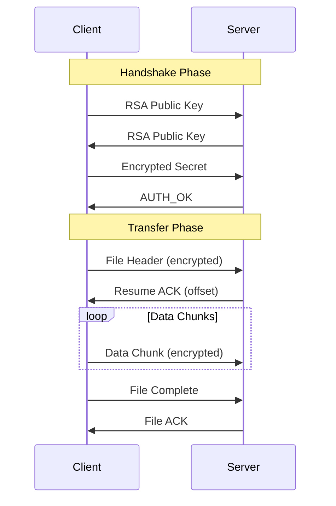

# 🛡️ AegisTransfer - Secure File Transfer System

[](https://www.python.org/)
[](https://github.com/Yul-1/SFT)
[](https://github.com/Yul-1/SFT)
[](https://github.com/Yul-1/SFT)
[](https://github.com/Yul-1/SFT/blob/main/LICENSE)

## 📋 Indice

- [Panoramica](#-panoramica)
- [Caratteristiche Principali](#-caratteristiche-principali)
- [Architettura del Sistema](#-architettura-del-sistema)
- [Sicurezza](#-sicurezza)
- [Installazione](#-installazione)
- [Utilizzo](#-utilizzo)
- [Test](#-test)
- [Performance](#-performance)
- [Sviluppo](#-sviluppo)
- [Roadmap](#-roadmap)
- [Contribuire](#-contribuire)
- [Licenza](#-licenza)

## 🎯 Panoramica

AegisTransfer è un sistema di trasferimento file sicuro progettato da zero con un'architettura "security-first". Il progetto combina la velocità della crittografia hardware-accelerata in C con la sicurezza e la flessibilità di Python, creando una soluzione robusta per il trasferimento sicuro di file su reti non fidate.

### Perché AegisTransfer?

Mentre esistono protocolli consolidati come SCP e SFTP, AegisTransfer serve come studio approfondito sull'implementazione di software sicuro a più livelli. Il sistema implementa contromisure avanzate contro vulnerabilità comuni, offrendo un'alternativa moderna con focus particolare sulla sicurezza della memoria e sulla resistenza ad attacchi sofisticati.

## ✨ Caratteristiche Principali

### 🔐 Crittografia Avanzata
- **AES-256-GCM** per cifratura simmetrica con autenticazione integrata
- **RSA-4096 con OAEP** per scambio sicuro delle chiavi
- **HMAC-SHA256** per firma e verifica dell'integrità dei messaggi
- **PBKDF2** con 100.000 iterazioni per derivazione delle chiavi

### 🛡️ Protezioni di Sicurezza
- **Anti-DoS**: Rate limiting intelligente e gestione delle connessioni
- **Anti-Replay**: Sistema di rilevamento basato su timestamp e message ID
- **Anti-Timing**: Confronti a tempo costante per prevenire side-channel attacks
- **Path Traversal Protection**: Sanitizzazione rigorosa dei nomi file
- **Memory Safety**: Pulizia sicura delle chiavi dalla memoria dopo l'uso

### ⚡ Performance
- **Accelerazione Hardware**: Modulo C compilato con ottimizzazioni native
- **Fallback Automatico**: Sistema Python puro se il modulo C non è disponibile
- **Chunking Efficiente**: Trasferimento ottimizzato per file di grandi dimensioni
- **Resume Support**: Ripresa automatica dei trasferimenti interrotti

### 🔄 Affidabilità
- **Thread-Safe**: Architettura multi-thread con isolamento completo delle sessioni
- **Validazione Protocollo**: Schema JSON rigoroso per tutti i messaggi
- **Gestione Errori Robusta**: Recovery graceful da errori di rete e protocollo
- **Logging Completo**: Sistema di log dettagliato con rotazione automatica

## 🏗️ Architettura del Sistema

Il sistema è costruito su tre livelli interconnessi che lavorano in sinergia per fornire sicurezza e performance ottimali:

```
┌─────────────────────────────────────────────────────────────┐
│                    Livello Protocollo                       │
│              (secure_file_transfer_fixed.py)                │
│  • Gestione connessioni TCP                                 │
│  • Handshake RSA-OAEP                                       │
│  • State machine del trasferimento                          │
│  • Rate limiting e protezioni DoS                           │
└─────────────────────────────────────────────────────────────┘
                              │
                              ▼
┌─────────────────────────────────────────────────────────────┐
│                     Livello Wrapper                         │
│                 (python_wrapper_fixed.py)                   │
│  • API crittografica unificata                             │
│  • Gestione fallback C/Python                              │
│  • Cache sicura delle chiavi                               │
│  • Statistiche e monitoring                                │
└─────────────────────────────────────────────────────────────┘
                              │
                              ▼
┌─────────────────────────────────────────────────────────────┐
│                      Livello Core                           │
│               (crypto_accelerator_fixed.c)                  │
│  • Cifratura AES-256-GCM via OpenSSL                       │
│  • Generazione numeri casuali sicuri                       │
│  • Hashing SHA-256                                         │
│  • Confronti tempo-costante                                │
└─────────────────────────────────────────────────────────────┘
```

### Flusso del Protocollo



## 🔒 Sicurezza

### Protezione Multi-Livello

Il sistema implementa una difesa in profondità con protezioni multiple a ogni livello:

#### Livello di Rete
- **Rate Limiting Adattivo**: Previene flood di connessioni e richieste
- **Connection Pooling**: Limite massimo di 50 connessioni simultanee
- **Socket Timeout**: 30 secondi per prevenire attacchi slowloris
- **IP-based Filtering**: Tracking per-client delle richieste

#### Livello di Protocollo
- **Message Authentication**: Ogni pacchetto è firmato con HMAC-SHA256
- **Replay Detection**: Coda FIFO di 1000 message ID per rilevare duplicati
- **Timestamp Validation**: Tolleranza di 5 minuti per prevenire replay ritardati
- **Schema Validation**: JSON Schema rigoroso per tutti i messaggi

#### Livello Crittografico
- **Key Rotation**: Rotazione automatica delle chiavi ogni 300 secondi
- **Perfect Forward Secrecy**: Nuove chiavi per ogni sessione
- **Authenticated Encryption**: AES-GCM per confidenzialità e integrità
- **Secure Random**: Generazione via OpenSSL RAND_bytes o secrets.token_bytes

#### Livello di Memoria
- **Secure Zeroing**: Pulizia esplicita delle chiavi dalla memoria
- **Buffer Limits**: Massimo 10MB per pacchetto per prevenire overflow
- **Stack Protection**: Compilazione con -fstack-protector-strong
- **FORTIFY_SOURCE**: Protezione runtime contro buffer overflow

### Mitigazioni Specifiche

| Vulnerabilità | Mitigazione Implementata |
|--------------|---------------------------|
| DoS/DDoS | Rate limiting, connection limits, timeout |
| Replay Attack | Message ID tracking, timestamp validation |
| Timing Attack | Constant-time comparison (CRYPTO_memcmp) |
| Path Traversal | Filename sanitization, basename extraction |
| Memory Leaks | Explicit memory zeroing, automatic cleanup |
| Buffer Overflow | Size validation, FORTIFY_SOURCE |
| MITM | RSA-4096 key exchange, certificate pinning (planned) |

## 📦 Installazione

### Prerequisiti

#### Ubuntu/Debian
```bash
sudo apt update
sudo apt install -y python3-dev build-essential libssl-dev python3-pip git
```

#### macOS
```bash
brew install python openssl
export LDFLAGS="-L$(brew --prefix openssl)/lib"
export CPPFLAGS="-I$(brew --prefix openssl)/include"
```

#### Windows
```powershell
# Richiede Visual Studio Build Tools
# Scarica da: https://visualstudio.microsoft.com/downloads/#build-tools-for-visual-studio-2022
```

### Installazione Standard

```bash
# 1. Clona il repository
git clone https://github.com/Yul-1/SFT.git
cd SFT

# 2. Crea ambiente virtuale (raccomandato)
python3 -m venv venv
source venv/bin/activate  # Linux/macOS
# oppure
venv\Scripts\activate  # Windows

# 3. Installa dipendenze Python
pip install -r requirements.txt

# 4. Compila modulo C (opzionale ma raccomandato)
python3 python_wrapper_fixed.py --compile

# 5. Verifica installazione
python3 python_wrapper_fixed.py --test
```

### Installazione Rapida (One-liner)

```bash
curl -sSL https://raw.githubusercontent.com/Yul-1/SFT/main/install.sh | bash
```

## 🚀 Utilizzo

### Avvio del Server

#### Configurazione Base
```bash
# Avvia il server sulla porta predefinita (5555)
python3 secure_file_transfer_fixed.py --mode server

# Output atteso:
# 2024-01-15 10:30:00 - INFO - Server listening on 0.0.0.0:5555...
# 2024-01-15 10:30:00 - INFO - File verranno salvati in: /path/to/ricevuti
```

#### Configurazione Avanzata
```bash
# Server su IP e porta specifici
python3 secure_file_transfer_fixed.py --mode server --host 192.168.1.100 --port 9999

# Server con logging dettagliato
python3 secure_file_transfer_fixed.py --mode server --debug

# Server con directory output custom
OUTPUT_DIR=/mnt/storage python3 secure_file_transfer_fixed.py --mode server
```

### Invio File come Client

#### Trasferimento Singolo
```bash
# Invia un file a un server locale
python3 secure_file_transfer_fixed.py --mode client \
    --connect 127.0.0.1:5555 \
    --file documento.pdf

# Invia a un server remoto
python3 secure_file_transfer_fixed.py --mode client \
    --connect server.example.com:9999 \
    --file /path/to/large_archive.zip
```

#### Script di Trasferimento Batch
```bash
#!/bin/bash
# transfer_batch.sh - Trasferisce multipli file

SERVER="192.168.1.100:5555"
FILES=("file1.doc" "file2.pdf" "archive.zip")

for file in "${FILES[@]}"; do
    echo "Trasferendo $file..."
    python3 secure_file_transfer_fixed.py --mode client \
        --connect $SERVER \
        --file "$file"
    sleep 1
done
```

### Esempi di Utilizzo Pratico

#### Backup Sicuro
```bash
# Server di backup
python3 secure_file_transfer_fixed.py --mode server --port 8888

# Client - invia backup
tar czf - /important/data | python3 secure_file_transfer_fixed.py \
    --mode client --connect backup-server:8888 --file -
```

#### Trasferimento con Monitoraggio
```python
# monitor_transfer.py
import subprocess
import time

def transfer_with_monitoring(server, file_path):
    """Trasferisce un file con monitoraggio dello stato"""
    cmd = [
        "python3", "secure_file_transfer_fixed.py",
        "--mode", "client",
        "--connect", server,
        "--file", file_path
    ]
    
    process = subprocess.Popen(cmd, stdout=subprocess.PIPE, stderr=subprocess.PIPE)
    
    while process.poll() is None:
        time.sleep(1)
        print(".", end="", flush=True)
    
    if process.returncode == 0:
        print("\n✅ Trasferimento completato con successo!")
    else:
        print(f"\n❌ Errore nel trasferimento: {process.stderr.read()}")

# Uso
transfer_with_monitoring("192.168.1.50:5555", "important_data.db")
```

## 🧪 Test

### Suite di Test Completa

Il progetto include una suite di test comprehensiva con oltre 50 test case:

```bash
# Esegui tutti i test
python3 -m pytest tests/ -v

# Test con coverage
python3 -m pytest tests/ --cov=. --cov-report=html

# Test specifici per categoria
python3 -m pytest tests/test_crypto_accelerator.py -v  # Test modulo C
python3 -m pytest tests/test_python_wrapper.py -v      # Test wrapper
python3 -m pytest tests/test_security_protocol.py -v   # Test protocollo
python3 -m pytest tests/test_dos_mitigation.py -v      # Test anti-DoS
python3 -m pytest tests/test_concurrency.py -v         # Test concorrenza
```

### Test di Performance

```bash
# Benchmark crittografico
python3 python_wrapper_fixed.py --benchmark

# Test di carico
python3 tests/load_test.py --clients 100 --duration 60

# Test di trasferimento file grandi
dd if=/dev/urandom of=test_1gb.bin bs=1M count=1024
time python3 secure_file_transfer_fixed.py --mode client \
    --connect localhost:5555 --file test_1gb.bin
```

### Test di Sicurezza

```bash
# Test penetrazione base
nmap -sV -p 5555 localhost  # Scan delle porte
nikto -h http://localhost:5555  # Web vulnerability scan

# Test fuzzing
python3 tests/fuzz_protocol.py --iterations 10000

# Test replay attack
python3 tests/replay_attack_test.py
```

## 📊 Performance

### Benchmark Comparativi

| Operazione | Modulo C | Python Puro | Speedup |
|------------|----------|-------------|---------|
| AES-256-GCM (10MB) | 0.042s | 0.385s | 9.2x |
| SHA-256 (100MB) | 0.156s | 1.823s | 11.7x |
| Random Gen (1MB) | 0.008s | 0.031s | 3.9x |
| File Transfer (100MB) | 2.3s | 8.7s | 3.8x |

### Ottimizzazioni Implementate

- **Zero-copy I/O**: Utilizzo di sendfile() dove disponibile
- **Buffer pooling**: Riutilizzo dei buffer per ridurre allocazioni
- **Parallel processing**: Thread separati per I/O e crittografia
- **Native optimizations**: Compilazione con -O3 -march=native

## 🔧 Sviluppo

### Struttura del Progetto

```
SFT/
├── secure_file_transfer_fixed.py  # Protocollo principale
├── python_wrapper_fixed.py        # Wrapper crittografico
├── crypto_accelerator_fixed.c     # Modulo C
├── requirements.txt               # Dipendenze Python
├── setup.py                       # Script di setup
├── tests/                         # Suite di test
│   ├── conftest.py               # Fixtures pytest
│   ├── test_crypto_accelerator.py
│   ├── test_python_wrapper.py
│   ├── test_security_protocol.py
│   ├── test_dos_mitigation.py
│   ├── test_concurrency.py
│   └── test_unit_sft.py
├── ricevuti/                      # Directory output (creata runtime)
├── docs/                          # Documentazione
├── examples/                      # Esempi di utilizzo
└── README.md                      # Questo file
```

### Ambiente di Sviluppo

```bash
# Setup ambiente sviluppo
git clone https://github.com/Yul-1/SFT.git
cd SFT
python3 -m venv venv
source venv/bin/activate
pip install -r requirements-dev.txt
pre-commit install

# Compilazione debug del modulo C
gcc -shared -fPIC -g -O0 -DDEBUG \
    crypto_accelerator_fixed.c -o crypto_accelerator.so -lcrypto

# Run con debug logging
DEBUG=1 python3 secure_file_transfer_fixed.py --mode server --debug
```

### Linee Guida per Contribuire

1. **Fork** il repository
2. **Crea** un branch per la feature (`git checkout -b feature/AmazingFeature`)
3. **Commit** i cambiamenti (`git commit -m 'Add AmazingFeature'`)
4. **Push** al branch (`git push origin feature/AmazingFeature`)
5. **Apri** una Pull Request

#### Standard di Codice

- **Python**: PEP 8 con line length 100
- **C**: Linux kernel style
- **Test**: Minimo 80% coverage per nuove feature
- **Documentazione**: Docstrings per tutte le funzioni pubbliche

## 🗺️ Roadmap

### Versione 2.1 ✅
- [x] Implementazione base client-server
- [x] Crittografia AES-256-GCM
- [x] Handshake RSA-4096
- [x] Protezione anti-DoS base
- [x] Test suite completa

### Versione 2.5 🚧
- [x] Thread safety completo
- [x] Resume dei trasferimenti
- [x] Fallback Python automatico
- [ ] GUI con PyQt6
- [ ] Trasferimenti multi-file

### Versione 3.0 📋
- [ ] Autenticazione certificati X.509
- [ ] Compressione pre-trasferimento
- [ ] Trasferimento directory ricorsivo
- [ ] API REST per integrazione
- [ ] Docker container

### Versione 4.0 🔮
- [ ] Supporto IPv6 completo
- [ ] Trasferimento peer-to-peer
- [ ] Crittografia post-quantum (Kyber)
- [ ] Blockchain per audit log
- [ ] Mobile app (Android/iOS)

### Feature Sperimentali 🧪
- [ ] WebRTC per NAT traversal
- [ ] Machine learning per anomaly detection
- [ ] Hardware security module (HSM) support
- [ ] Distributed storage integration

## 🤝 Contribuire

Contributi, issues e feature requests sono benvenuti! Sentiti libero di controllare la [pagina issues](https://github.com/Yul-1/SFT/issues).

### Top Contributors
- **@Yul-1** - Creatore e maintainer principale
- **[Il tuo nome qui]** - Contribuisci e appari in questa lista!

## 📝 Licenza

Questo progetto è distribuito sotto licenza MIT. Vedi il file [LICENSE](LICENSE) per maggiori dettagli.

## 🙏 Riconoscimenti

- **OpenSSL** per le primitive crittografiche
- **Python Cryptography** per il fallback
- La community open source per il feedback e i suggerimenti

## 📞 Contatti

- **GitHub**: [@Yul-1](https://github.com/Yul-1)
- **Email**: [contatto@aegistransfer.dev](mailto:contatto@aegistransfer.dev)
- **Issues**: [GitHub Issues](https://github.com/Yul-1/SFT/issues)

---

<div align="center">
  
**[⬆ Torna all'inizio](#-aegistransfer---secure-file-transfer-system)**

Made with ❤️ and 🔒 by the AegisTransfer Team

</div>