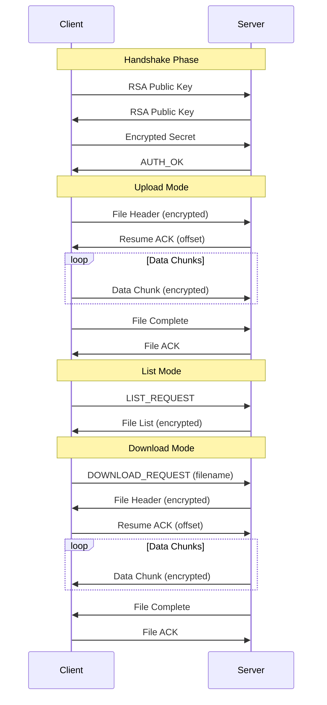

# 🛡️ Secure File Transfer System

[](https://www.python.org/)
[](https://github.com/Yul-1/SFT)
[](https://github.com/Yul-1/SFT)
[](https://github.com/Yul-1/SFT)
[](https://github.com/Yul-1/SFT)

## 📋 Table of Contents

- [Overview](#-overview)
- [Key Features](#-key-features)
- [System Architecture](#-system-architecture)
- [Security](#-security)
- [Installation](#-installation)
- [Usage](#-usage)
- [Testing](#-testing)
- [Performance](#-performance)
- [Development](#-development)
- [Roadmap](#-roadmap)
- [Contributing](#-contributing)
- [License](#-license)

## 🎯 Overview

Secure File Transfer is a **bidirectional** secure file transfer system designed from the ground up with a "security-first" architecture. The project combines the speed of hardware-accelerated cryptography in C with the security and flexibility of Python, creating a robust solution for secure file transfer over untrusted networks.

**Current version: 2.6** - Complete support for upload, download, and remote file listing.

### Why Secure File Transfer?

While established protocols like SCP and SFTP exist, Secure File Transfer serves as an in-depth study on implementing secure multi-layered software. The system implements advanced countermeasures against common vulnerabilities, offering a modern alternative with particular focus on memory security and resistance to sophisticated attacks.

### Key Features v2.6
- **Secure upload** of files to the server
- **Secure download** of files from the server
- **Remote listing** to view available files
- **Automatic resume** of interrupted transfers
- **End-to-end encryption** with AES-256-GCM and RSA-4096

## ✨ Key Features

### 🔐 Advanced Encryption
- **AES-256-GCM** for symmetric encryption with integrated authentication
- **RSA-4096 with OAEP** for secure key exchange
- **HMAC-SHA256** for message integrity signing and verification
- **PBKDF2** with 100,000 iterations for key derivation

### 🛡️ Security Protections
- **Anti-DoS**: Intelligent rate limiting and connection management
- **Anti-Replay**: Detection system based on timestamps and message IDs
- **Anti-Timing**: Constant-time comparisons to prevent side-channel attacks
- **Path Traversal Protection**: Strict filename sanitization
- **Memory Safety**: Secure cleanup of keys from memory after use

### ⚡ Performance
- **Hardware Acceleration**: C module compiled with native optimizations
- **Automatic Fallback**: Pure Python system if C module is unavailable
- **Efficient Chunking**: Optimized transfer for large files
- **Resume Support**: Automatic resumption of interrupted transfers

### 🔄 Reliability
- **Thread-Safe**: Multi-threaded architecture with complete session isolation
- **Bidirectional**: Upload, download, and remote file listing
- **Protocol Validation**: Strict JSON schema for all messages
- **Robust Error Handling**: Graceful recovery from network and protocol errors
- **Comprehensive Logging**: Detailed logging system with automatic rotation

## 🏗️ System Architecture

The system is built on three interconnected layers that work in synergy to provide optimal security and performance:

```
┌─────────────────────────────────────────────────────────────┐
│                    Protocol Layer                           │
│                       (sft.py)                              │
│  • TCP connection management                                │
│  • RSA-OAEP handshake                                       │
│  • Transfer state machine                                   │
│  • Rate limiting and DoS protections                        │
└─────────────────────────────────────────────────────────────┘
                              │
                              ▼
┌─────────────────────────────────────────────────────────────┐
│                     Wrapper Layer                           │
│                 (python_wrapper.py)                         │
│  • Unified cryptographic API                                │
│  • C/Python fallback management                             │
│  • Secure key cache                                         │
│  • Statistics and monitoring                                │
└─────────────────────────────────────────────────────────────┘
                              │
                              ▼
┌─────────────────────────────────────────────────────────────┐
│                      Core Layer                             │
│               (crypto_accelerator.c)                        │
│  • AES-256-GCM encryption via OpenSSL                       │
│  • Secure random number generation                          │
│  • SHA-256 hashing                                          │
│  • Constant-time comparisons                                │
└─────────────────────────────────────────────────────────────┘
```

### Protocol Flow



## 🔒 Security

### Multi-Layer Protection

The system implements defense in depth with multiple protections at every layer:

#### Network Layer
- **Adaptive Rate Limiting**: Prevents connection and request flooding
- **Connection Pooling**: Maximum limit of 50 simultaneous connections
- **Socket Timeout**: 30 seconds to prevent slowloris attacks
- **IP-based Filtering**: Per-client request tracking

#### Protocol Layer
- **Message Authentication**: Every packet is signed with HMAC-SHA256
- **Replay Detection**: FIFO queue of 1000 message IDs to detect duplicates
- **Timestamp Validation**: 5-minute tolerance to prevent delayed replays
- **Schema Validation**: Strict JSON Schema for all messages

#### Cryptographic Layer
- **Key Rotation**: Automatic key rotation every 300 seconds
- **Perfect Forward Secrecy**: New keys for each session
- **Authenticated Encryption**: AES-GCM for confidentiality and integrity
- **Secure Random**: Generation via OpenSSL RAND_bytes or secrets.token_bytes

#### Memory Layer
- **Secure Zeroing**: Explicit cleanup of keys from memory
- **Buffer Limits**: Maximum 10MB per packet to prevent overflow
- **Stack Protection**: Compilation with -fstack-protector-strong
- **FORTIFY_SOURCE**: Runtime protection against buffer overflow

### Specific Mitigations

| Vulnerability | Implemented Mitigation |
|--------------|------------------------|
| DoS/DDoS | Rate limiting, connection limits, timeout |
| Replay Attack | Message ID tracking, timestamp validation |
| Timing Attack | Constant-time comparison (CRYPTO_memcmp) |
| Path Traversal | Filename sanitization, basename extraction |
| Memory Leaks | Explicit memory zeroing, automatic cleanup |
| Buffer Overflow | Size validation, FORTIFY_SOURCE |
| MITM | RSA-4096 key exchange, certificate pinning (planned) |

## 📦 Installation

### Prerequisites

#### Ubuntu/Debian
```bash
sudo apt update
sudo apt install -y python3-dev build-essential libssl-dev python3-pip git
```

#### macOS
```bash
brew install python openssl
export LDFLAGS="-L$(brew --prefix openssl)/lib"
export CPPFLAGS="-I$(brew --prefix openssl)/include"
```

#### Windows
```powershell
# Requires Visual Studio Build Tools
# Download from: https://visualstudio.microsoft.com/downloads/#build-tools-for-visual-studio-2022
```

### Standard Installation

```bash
# 1. Clone the repository
git clone https://github.com/Yul-1/Secure-File-Transfer
cd SFT

# 2. Create virtual environment (recommended)
python3 -m venv venv
source venv/bin/activate  # Linux/macOS
# or
venv\Scripts\activate  # Windows

# 3. Install Python dependencies
pip install -r requirements.txt

# 4. Compile C module (optional but recommended)
python3 python_wrapper.py --compile

# 5. Verify installation
python3 python_wrapper.py --test
```


## 🚀 Usage

### Starting the Server

#### Basic Configuration
```bash
# Start server on default port (5555)
python3 sft.py --mode server

# Start on specific port
python3 sft.py --mode server --port 8080

# Start on specific interface
python3 sft.py --mode server --host 192.168.1.100 --port 5555
```

#### Production Configuration
```bash
# Production server with logging
nohup python3 sft.py --mode server \
    --host 0.0.0.0 \
    --port 5555 > server.log 2>&1 &
```

### Client Operations

#### Upload File
```bash
# Upload file to server
python3 sft.py --mode client \
    --connect 192.168.1.100:5555 \
    --file /path/to/document.pdf

# Upload with progress
python3 sft.py --mode client \
    --connect server.example.com:5555 \
    --file large_file.zip
```

#### List Remote Files
```bash
# List available files on server
python3 sft.py --mode client \
    --connect 192.168.1.100:5555 \
    --list
```

#### Download File
```bash
# Download specific file
python3 sft.py --mode client \
    --connect 192.168.1.100:5555 \
    --download document.pdf

# Download to specific directory
python3 sft.py --mode client \
    --connect 192.168.1.100:5555 \
    --download backup.tar.gz \
    --output /home/user/downloads/

# Resume interrupted download
python3 sft.py --mode client \
    --connect 192.168.1.100:5555 \
    --download large_file.iso \
    --output ./downloads/
```

### Advanced Examples

#### Bidirectional Secure Backup
```bash
# Backup server
python3 sft.py --mode server --port 8888

# Client - send backup
python3 sft.py --mode client \
    --connect backup-server:8888 \
    --file /path/to/backup.tar.gz

# Client - retrieve previous backups
# 1. List available backups
python3 sft.py --mode client \
    --connect backup-server:8888 \
    --list

# 2. Download specific backup
python3 sft.py --mode client \
    --connect backup-server:8888 \
    --download backup_2024-11-22.tar.gz \
    --output /restore/
```

#### Transfer with Monitoring
```python
# monitor_transfer.py
import subprocess
import time

def transfer_with_monitoring(server, file_path):
    """Transfer file with status monitoring"""
    cmd = [
        "python3", "sft.py",
        "--mode", "client",
        "--connect", server,
        "--file", file_path
    ]
    
    process = subprocess.Popen(cmd, stdout=subprocess.PIPE, stderr=subprocess.PIPE)
    
    while process.poll() is None:
        time.sleep(1)
        print(".", end="", flush=True)
    
    if process.returncode == 0:
        print("\n✅ Transfer completed successfully!")
    else:
        print(f"\n❌ Transfer error: {process.stderr.read()}")

# Usage
transfer_with_monitoring("192.168.1.50:5555", "important_data.db")
```

## 🧪 Testing

### Comprehensive Test Suite

The project includes a comprehensive test suite with over 50 test cases:

```bash
# Run all tests
python3 -m pytest tests/ -v

# Category-specific tests
python3 -m pytest tests/test_crypto_accelerator.py -v  # C module tests
python3 -m pytest tests/test_python_wrapper.py -v      # Wrapper tests
python3 -m pytest tests/test_security_protocol.py -v   # Protocol tests
python3 -m pytest tests/test_dos_mitigation.py -v      # Anti-DoS tests
python3 -m pytest tests/test_concurrency.py -v         # Concurrency tests
```

### Performance Testing

```bash
# Cryptographic benchmark
python3 python_wrapper.py --benchmark

# Large file transfer test
dd if=/dev/urandom of=test_1gb.bin bs=1M count=1024
time python3 sft.py --mode client \
    --connect localhost:5555 --file test_1gb.bin
```

## 📊 Performance

### Comparative Benchmarks

| Operation | C Module | Pure Python | Speedup |
|-----------|----------|-------------|---------|
| AES-256-GCM (10MB) | 0.042s | 0.385s | 9.2x |
| SHA-256 (100MB) | 0.156s | 1.823s | 11.7x |
| Random Gen (1MB) | 0.008s | 0.031s | 3.9x |
| File Transfer (100MB) | 2.3s | 8.7s | 3.8x |

### Implemented Optimizations

- **Zero-copy I/O**: Use of sendfile() where available
- **Buffer pooling**: Buffer reuse to reduce allocations
- **Parallel processing**: Separate threads for I/O and cryptography
- **Native optimizations**: Compilation with -O3 -march=native

## 🔧 Development

### Project Structure

```
SFT/
├── sft.py                          # Main protocol (v2.6)
├── python_wrapper.py               # Cryptographic wrapper
├── crypto_accelerator.c            # C module (source)
├── crypto_accelerator.so           # Compiled C module
├── requirements.txt                # Python dependencies
├── tests/                          # Test suite
│   ├── conftest.py                # Pytest fixtures
│   ├── test_crypto_accelerator.py
│   ├── test_python_wrapper.py
│   ├── test_security_protocol.py
│   ├── test_dos_mitigation.py
│   ├── test_concurrency.py
│   ├── test_unit_sft.py
│   ├── test_p0_security.py        # Priority 0 security tests
│   ├── test_p1_robustness.py      # Priority 1 robustness tests
│   ├── test_p2_completeness.py    # Priority 2 completeness tests
│   └── test_p2_unit_completeness.py
├── received/                       # Output directory (created at runtime)
└── README.md                       # This file
```

### Development Environment

```bash
# Setup development environment
git clone https://github.com/Yul-1/Secure-File-Transfer
cd SFT
python3 -m venv venv
source venv/bin/activate
pip install -r requirements.txt

# Debug compilation of C module
gcc -shared -fPIC -g -O0 -DDEBUG \
    crypto_accelerator.c -o crypto_accelerator.so -lcrypto

# Run with debug logging
DEBUG=1 python3 sft.py --mode server --debug
```

### Contributing Guidelines

1. **Fork** the repository
2. **Create** a feature branch (`git checkout -b feature/AmazingFeature`)
3. **Commit** your changes (`git commit -m 'Add AmazingFeature'`)
4. **Push** to the branch (`git push origin feature/AmazingFeature`)
5. **Open** a Pull Request

#### Code Standards

- **Python**: PEP 8 with line length 100
- **C**: Linux kernel style
- **Tests**: Minimum 80% coverage for new features
- **Documentation**: Docstrings for all public functions

## 🗺️ Roadmap

### Version 2.1 ✅
- [x] Basic client-server implementation
- [x] AES-256-GCM encryption
- [x] RSA-4096 handshake
- [x] Basic anti-DoS protection
- [x] Complete test suite

### Version 2.5 ✅
- [x] Complete thread safety
- [x] Transfer resume
- [x] Automatic Python fallback

### Version 2.6 ✅ (Current)
- [x] Bidirectional functionality (upload and download)
- [x] `--list` command to list remote files
- [x] `--download` command to download files from server
- [x] Customizable output directory
- [x] Extended test suite with priorities (P0, P1, P2)

### Version 3.0 📋
- [ ] GUI with PyQt6
- [ ] Simultaneous multi-file transfers
- [ ] X.509 certificate authentication
- [ ] Pre-transfer compression
- [ ] Recursive directory transfer
- [ ] REST API for integration
- [ ] Docker container

### Version 4.0 🔮
- [ ] Complete IPv6 support
- [ ] Peer-to-peer transfer
- [ ] Post-quantum cryptography (Kyber)
- [ ] Blockchain for audit log
- [ ] Mobile app (Android/iOS)

### Experimental Features 🧪
- [ ] WebRTC for NAT traversal
- [ ] Machine learning for anomaly detection
- [ ] Hardware security module (HSM) support
- [ ] Distributed storage integration

## 🤝 Contributing

Contributions, issues, and feature requests are welcome! Feel free to check the [issues page](https://github.com/Yul-1/SFT/issues).

### Top Contributors
- **@Yul-1** - Creator and main maintainer
- **[Your name here]** - Contribute and appear in this list!

## 📝 License

This project is distributed under the MIT License.

## 🙏 Acknowledgments

- **OpenSSL** for cryptographic primitives
- **Python Cryptography** for fallback
- The open source community for feedback and suggestions

## 📞 Contact

- **GitHub**: [@Yul-1](https://github.com/Yul-1)
- **Issues**: [GitHub Issues](https://github.com/Yul-1/SFT/issues)
- **Mail**: [yul.cysec@gmail.com]
---

<div align="center">
  
**[⬆ Back to top](#-secure-file-transfer-system)**

</div>